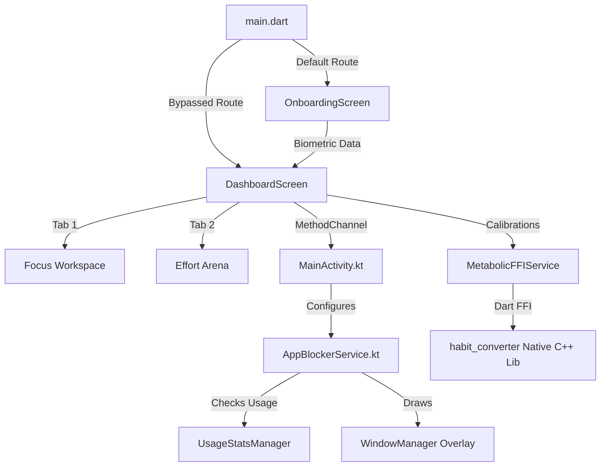

# DareAI (powered by Antigravity Core)

**DareAI** is a premium, high-discipline focus and metabolic tracking application built with Flutter. It utilizes a native Android background service to enforce discipline by blocking addictive apps (like YouTube, TikTok, Facebook, and Instagram) and utilizes a precompiled native C++ metabolic engine to project active calorie burn and fat loss metrics based on user biometrics.

---

## 🌟 Key Features

### 1. External App Blocker (Native Android Service)
* **Real-time Monitoring**: Running a background thread via Android's `UsageStatsManager` that polls the active foreground package.
* **Draw Over Apps Overlay**: Renders a dark, glassmorphic fullscreen overlay via `SYSTEM_ALERT_WINDOW` if a restricted app comes into focus during procrastination.
* **Dynamic Configuration**: Configure which apps to block directly from the Flutter dashboard. Toggling selections immediately updates the native Android backend via MethodChannels.
* **Discipline Toll**: Features a **"Simulate Exercise Completion"** button on the native blocker window to release the lock and notify the Flutter app.

### 2. Biometric Onboarding & FFI Metabolic Engine
* **Biometric Calibration**: Dynamic PageView onboarding flow for capturing user weight, daily focus targets, and physical movement commitments.
* **C++ Engine Bindings**: Integrates with a pre-compiled native library (`habit_converter`) via Dart FFI.
* **Metabolic Projections**: Dynamically calculates calorie burn rate per minute, daily active burn, and 30-day projected calorie/fat loss values.

### 3. Modular Tabbed Layout
* **Focus Workspace**: Houses active focus timers, restricted app selection chips, and diagnostic simulation triggers.
* **Effort Arena**: Displays real-time metabolic status, interactive weight/duration calibration sliders, and a visual muscle engagement mapping card.
* **Onboarding Persistence**: Onboarding states are cached so that returning users skip onboarding directly to the core dashboard.

---

## 🛠️ Architecture



---

## 🚀 Getting Started

### Prerequisites
* Flutter SDK (3.x recommended)
* Android SDK (API level 29+ recommended for usage statistics and alert overlays)
* A physical Android device or emulator with Google Play Services (to grant Draw Over Apps & Usage Stats permissions)

### Installation

1. **Clone the repository**:
   ```bash
   git clone https://github.com/unhuconlon-afk/DareAI.git
   cd DareAI
   ```

2. **Fetch Flutter Dependencies**:
   ```bash
   flutter pub get
   ```

3. **Run the App**:
   Since the app contains custom native Android Kotlin code and resources, a hot restart will not register changes. Rebuild the package:
   ```bash
   flutter run
   ```

### 🔒 Granting Permissions
1. Launch the app and complete the **Biometric Calibration** onboarding.
2. In the **Focus Workspace** tab, look at the status banner. If permissions are missing, click **Grant Overlay Permission** and **Grant Usage Stats Permission**.
3. Toggle the restricted apps you want to block in the settings card.
4. Click **Trigger Stagnation Lock Screen** and go back to your Android Home screen.
5. Attempt to open a restricted app (e.g. YouTube) and experience the discipline blocker in action!