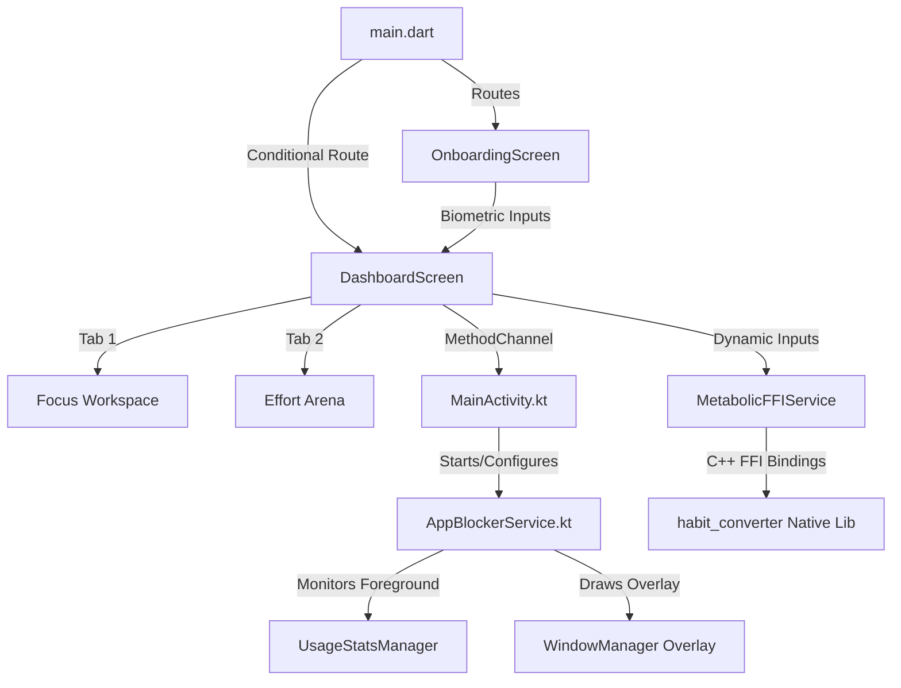

# Antigravity App - Project Progress Report (21/06 20:23)

This document compiles the current implementation status, architectural layout, and overall progress of the **Antigravity App** (focus/discipline tool).

---

## 🚀 Key Features Implemented

### 1. External App Blocker (Native Android Service)
* **Native Background Monitoring**: Created `AppBlockerService.kt` to monitor the active foreground application using the Android `UsageStatsManager` once every second.
* **Draw Over Apps Overlay**: Programmatically draws a dark semi-transparent glassmorphic native overlay (`SYSTEM_ALERT_WINDOW`) blocking the target app screen when a restricted package is in focus.
* **Interactive Lock Screen**: Includes a dynamic instruction block and a **"Simulate Exercise Completion"** button on the native side. Clicking it releases the lock, stops the overlay, and updates the Flutter state.
* **Dynamic Configurations**: Toggled apps (YouTube, TikTok, Facebook, Instagram) are synced via MethodChannel from the Flutter settings screen to the Kotlin backend.

### 2. Biometric Onboarding & FFI Metabolic Engine
* **Biometric Calibration Flow**: Created a premium multi-step PageView onboarding screen. Captures user parameters:
  * Weight (kg)
  * Focus target duration (minutes/day)
  * Physical movement commitment selection.
* **C++ Metabolic Engine integration (FFI)**: Biometric data is dynamically piped into a pre-compiled native library (`.so` / `.dll`).
* **Real-time Calorie Projections**: The C++ engine computes:
  * Burn rate per minute
  * Daily calorie burn rate
  * 30-day projection of active calorie burn and fat loss metrics (e.g., `9969 Kcal` / `1.29 kg` projection).

### 3. Modular Interface Structure
* **Focus Workspace**: Timer controls, application-blocking toggles, and simulator utilities.
* **Effort Arena**: Real-time biological data widgets, active energy metrics, interactive weight/duration calibration sliders, and a visual muscle engagement map.
* **Session Persistence**: Stores onboarding state in memory via `app_config.dart` to automatically skip onboarding on subsequent startups if completed in the current session.

---

## 🛠️ Recent UX Refinements & Bug Fixes
1. **Conditional Visibility**: The "Trigger Stagnation Lock Screen" button now strictly shows only when the system is in `Stagnant Mode` (`_isActive == false`), preventing redundant triggers while the timer is active.
2. **Permission Banner Wording**:
   * Displays *"System Ready (Permissions Secured)"* when permissions are verified but the app is unlocked.
   * Displays *"App Blocker Active"* when the lock is actively engaged.
3. **Compile Error Resolved**: Corrected a relative import path issue in `dashboard_screen.dart` which referenced `services/anti_procrastination_service.dart` instead of `../services/anti_procrastination_service.dart`, fixing a compiler crash.

---

## 📐 Current Technical Architecture

---

## 📋 Status Checklist

- [x] **Native Permissions** (`SYSTEM_ALERT_WINDOW` & `PACKAGE_USAGE_STATS`)
- [x] **Kotlin Background Blocker Service** (`AppBlockerService.kt`)
- [x] **Flutter MethodChannel Sync** (`app_blocker_service.dart` & `MainActivity.kt`)
- [x] **Dynamic Configuration of Restricted Apps**
- [x] **Biometric Calibration Onboarding Flow**
- [x] **Tabbed Architecture (Focus Workspace vs. Effort Arena)**
- [x] **Interactive Calibration Sliders & Dynamic FFI Engine Recalculation**
- [x] **UX Improvements & Import Path Fixes**
